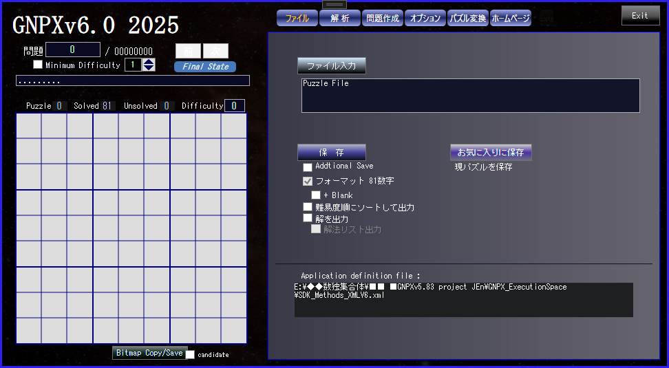
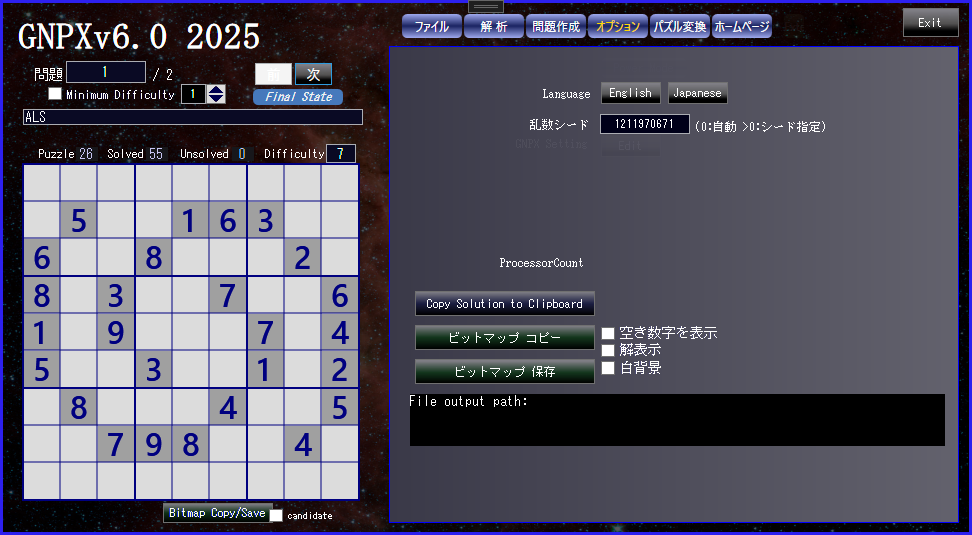

# GNPX マニュアル
- プログラムは SUDOKU_App/GNPX_vx.xx.exe です。
- SDK_Methods_XMLV6.xml は、実行時の定義データです。 GNPXが生成・管理します。
  通常、ユーザーは編集する必要はありません。もしも編集に失敗したときは、削除してください。後のことはシステムが対処します。
- VisualStudioプロジェクトをコンパイルしたときは、GNPX.exe または 仮身を SUDOKU_App フォルダーに配置して下さい。
<br>
- Panelは、Mouseで移動できます。(応答が悪い場合があります。)

<br><br><br>


# 0. 最初に
 まず最初に、全体的な操作の感触を持つために、次のことを行うと良いでしょう。<br>
(1)"ファイル入力"をクリック<br>
- ファイル選択のダイアログが開くので、”GNPX_1_SAMPLE2_v6.txt”を開く。<br>

<br>

(2)上段左から２番目の”解析"をクリック(選択したボタンはオレンジになる)<br>
- プログラム起動の最初は、"手法(オレンジ)”選択ページが開く。
  2回目以降の”解析"クリックでは、この手順は省かれます。<br>

<br>

(3)2段目の”解析"をクリックする。<br>
- 右側に 解析手法のリストが表示される(”解析”ボタン右の"M"クリックで消せる)<br>
- "解析”:パズルを１ステップ解く<br>
- "戻す”:パズルを１ステップ戻す<br>
- "全解析”:パズルを最後まで解く(下図)<br>
- "全リセット”:パズルの最初に戻す<br>


<br><br><br><br><br>


# 1. File
## OpenPuzzle File(パズルファイルを開く)
- 数独の問題ファイルを開きます。<br>
- ファイルフォーマットは、以下のように、空白(0または.)、数字(1-9)のテキストです。<br>
- 空白と改行は入力時に削除してから判読処理を行うので、... 多くの形式に対応しています。<br>
- Sudoku Data File sampl. (see 'SUDOKU_App/GNPX_1_SAMPLE2.txt')**
``` data file sample
023000800406080070780300502007008200060020700000650084602590400010004057005001020
032170608804009070750000000600008457200000006070400000300500084020900500400610702
000608300007004500600730428060000013004000600000300207518020030403006000296000700
.3.1.5.8...........8.....2...9.1.2...5.3.9.4..6.....7.7..6.1..851..7..69..8...7..
...3.9...3.......564.....89.........89..2..51..6.5.8..5.1...7.8.3.5.4.2.7..1.2..3
4....9.5.23..58.67...4.7.........3253.2....8.5.1...7.....89....9......7..1.72..46
```
<br>


<br><br>

## Save File(パズルのファイル保存)
入力・作成した数独の問題を、ファイルに保存します。
ファイルが存在するときの上書き/追記、フォーマット、用いた解法のリスト、難易度付加など、いくつかのオプションがあります。

## Save to favorities(お気に入りファイルに保存)
- 現在表示中の問題(難しい問題、気に入った問題など)を追記保存します。ファイル名は SDK_Favorite.txt です。
<br><br><br><br><br>


# 2. Solve(解析)
- 現在表示中の問題を解きます。<br>
- プログラム起動の最初は、"手法”選択ページが開きます。２回目以降の”解析"のクリックでは、この手順は省かれます。<br>

- パズルファイルから、解析対象のパズルを選択します。"前”、"次"、あるいは パズル番号を入力/Enterで、選択します。<br>
- パズルの Difficulty を指定してスキップ選択ができます。<br>
Solve(解析)では、左ボードにパズル数字列をペーストして、問題を設定できます。("ファイル”では paste 不可)<br>


<br><br><br><br>


## 2.1 Solve / Solve(解析)
### Solve / Undo / SolveUp / InitialState
- "Solve" は、1ステップづつ解きます。同じ解法で複数セルの複数数字が確定する、あるいは候補から除外されることがあります。
- 'Undo' は、１ステップもとに戻します。
- "SolveUp" は、最後まで解きます。
- "InitialState" は、最初の状態に戻します。<br>
- "Final State" は、Puzzleの最終状態です(これを求めるのに、数独解析アルゴリズムは使いません）。

上の蘭には、適用したアルゴリズム名とその詳細を示します。<br>
下の蘭には、ここまでのステップで適用したアルゴリズムと適用回数を示します。<br>
アルゴリズムによっては上欄に収まらない情報があるときには、別に情報ウインドウが開きます。<br>


<br><br><br><br>


## 2.2 Solve / MultiSolve(複数解析)
### MultiSolve / |< / <
- 1つの局面に対し適用可能なアルゴリズムを求めます。求めるアルゴリズムの数は、アルゴリズムのレベル、種類数、数、時間で制限されます。
- 下欄のアルゴリズムを選ぶと、その詳細な説明を上の欄に表示します。また、左図には、そのアルゴリズムで確定あるいは除外した候補数字を表示します。
- 求めたアルゴリズムを選択した状態で MultiSolve(複数解析)をクリックすると、その結果から次の局面を解析します。
- '<'クリックで、１ステップ前の状態に戻ります。アルゴリズムリストも前の状態です。
- '|<’クリックで、初期局面に戻ります。<br>


<br><br><br><br>


## 2.3 Solve / Method
### Method and Order
- 数独を解くアルゴリズムは、"Difficulty"と"Recommend"の2通りで指定できます。
("Recommend"はプログラムを書き換えて、任意に変更できます。)
- アルゴリズムの有効/無効指定を指定できます。
- 適用順を指定できます。

- ここでの指定と順序は、システムが定義ファイルに保存します。
- "Single"アルゴリズムは、常に有効で、順序は変更できません。
- アルゴリズム"GeneralLogic"の順序は固定です。全てのアルゴリズムを含む万能アルゴリズムなので、これを有効にしたときは、他のアルゴリズムは適用しません。"GeneralLogic"に関しては、HPに解説しています。
- 'GeneralLogic'は、'Solve/MethodOption'で有効/無効に設定します。<br>


<br><br><br><br>


## 2.4 Solve / MethodOption
- ALS / Max.Size : アルゴリズムで用いる ALS(Almost Locked Set) の最大サイズ。
- NiceLoop / Max.Size : アルゴリズムで用いる (Grouped)NiceLoop の最大サイズ。
- Link type : eNetwork に含むタイプを指定できます
- Force Chain /
 - Force_Chain の解の求め方を指定します。1つのみ/1つの数字(またはセル)のみ/全て　を指定できます。
- General Logic /
 - GeneralLogic はすべての解法アルゴリズムを包含するアルゴリズムなので、適用する/しないを指定する。
 - GeneralLogicのサイズは、Baseset Sizeのサイズで、その最大値を指定する。
 - Rank = (Coverset Size) - (Baseset Size).<br>


<br><br><br><br>


# 3. Create

## 3.1 Create / Manual
- マニュアルで、数独の問題を左の9ｘ9の升目に作ります.
  - 最初に、頭の中で、入力する数字を強くイメージする。
  - 9ｘ9の升目の入力する位置をクリックすると、指定位置にイメージした数字が表れる。<br>
   もしも、イメージしたのと異なる数字が現れたときは、あなたのイメージパワーが弱かったからです。<br>
   その場合は、再度、強く強くイメージしてクリックする。これは何度でも試行できます。
  - 入力済み数字を取り消すときは、"消えろ"と強く念じながら、その数字を再度クリックする。
- New, Copy, Clear, Delete はその意味とおりです。
- 81個の数字からなる文字列(空白は0または".")は、左図内にペースト入力できます。
文字列中の空白と改行は削除するので、多様なフォーマットに対応します。<br>


<br><br><br>


## 3.2 Create / Auto
- 最初に、数独のパターンを設定します。
  - 点対称(2種)、線対称(4種)の対称形パターンと非対称が指定できます。
- 'Pattern'をクリックすると、ランダムなパターンを生成します。
  - 指定セル数は'Minimum'で指定します。
  - 生成されたパターは、セルをクリックして修正できます。このとき、パターンの対称形指定が働きます。
  - 'Pattern Capture'クリックで、左に表示の数独のパターンを取り込みます。
- 'Generate Puzzle'クリックで、数独問題を生成します。
  - 指定パターン形、パターン数、数独の難易度レベルによって、生成時間が大きく異なります。
  - 生成時に、数字のランダム化を指定できます。
  - 生成時にいくつかの情報を表示します。<br>


<br><br><br>

# 4. Option
- 実行環境に応じて、プログラムの表記が日本語版と英語版になります。ボタン選択で、変更もできます。
- システムで用いる乱数の初期値を指定します。'0'は、自動的にランダムに初期値を設定します。
- 左に表示の数独のビットマップをバッファーにコピー、あるいは、ホルダーに保存します。
  - 保存時の、フォルダー名は固定、保存ファイル名は自動で生成します。
  - いくつかのオプションがあります。<br>


<br><br><br>


# 5 Transpose
## 5.1 Transpose/Transpose
数独問題の見かけを変更します。この変更でも、数独問題の本質は変化しません。
- 表示中の数字を変更します。
  - 数独問題のセルをクリックすると、クリック順にそのセルの数字が変更できます。既に変更した箇所の再変更もできます(矛盾しないように処理します)。
  - ランダムに変更もできます。
- 行順の変更、列順の変更、行列の対称変換が出来ます。
  - 中段は、対称性を維持する変換、下段は、対称性を保存しない変換です。
  - 下段のボタン横の数字は、各変換方法の変換回数です。0が最初の状態です。
- 'Save'クリックで、変換後のパズルを、保存します(システム内の保存で、外部ファイルへの保存は別途必要です)。<br>


<br><br><br>


## 5.1 Transpose/Standardization
数独問題を標準形に変換します。
- 5.1の見かけをどのように変更しても、標準形は１つです。
  - 標準形の定義、求め方は、HPで解説します。
- 標準形への変換手順を、ボックス内に表示します。
- 標準形への変換は、数字変換と行・列・対象変換をコード化出来ます。
  - 数独問題を変換しても、標準形は一意であり、標準形はコードで表現できます。<br>
(ここでの手順により、文字通り、あらゆる数独問題を順序付けることが可能です。)


<br><br><br>

# 6 Homepage
Jump to HP from the application.<br>


<br><br><br>